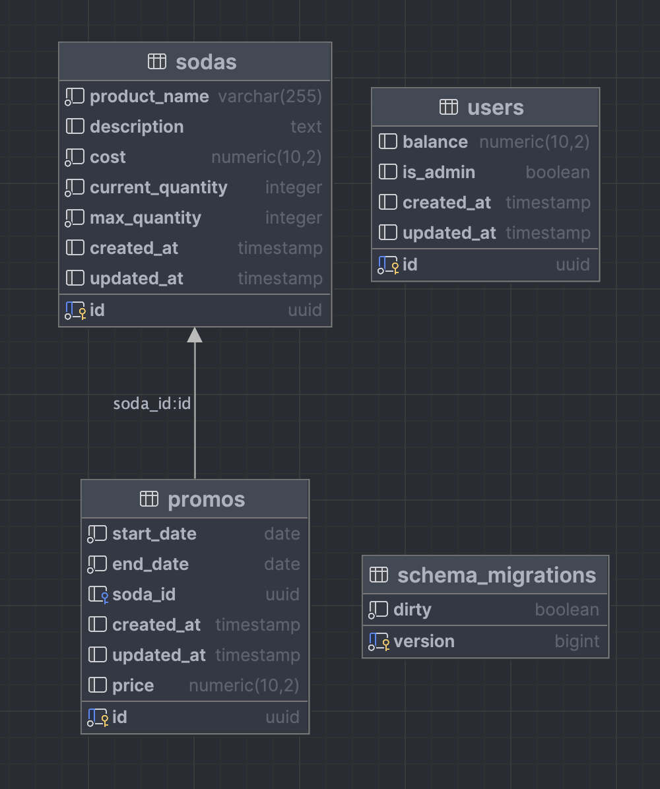

# "Yeah, yeah, just show me how to run the damn thing"
```
$ cp .env.docker .env
$ docker-compose up --build
$ ./scripts/migrate
```
Then go to the `frontend.md` doc to run the front-end. For development, the go api uses the incredible `air` tool to get hot-reloading of the api, to run it, you just need to `cd colaco-server` and run `air -c air.conf` and it'll start right up (after you run `cp .env.example .env`).

## Recipes
`YOUR_AUTH_TOKEN` is the uuid associated with your account in the browser cookies.

#### Promos
Make a Promo
```
curl --request POST \
  --url http://localhost:8000/v1/promos \
  --header 'Content-Type: application/json' \
  --header 'User-Agent: insomnia/8.5.1' \
  --header 'x-auth-token: YOUR_AUTH_TOKEN' \
  --data '{
	"start_date": "2024-01-04T14:01:15-05:00",
	"end_date": "2024-01-31T14:01:15-05:00",
	"soda_id": "SODA_UUID",
	"price": 0.5
}'
```

Get Promos
```
curl --request GET \
  --url http://localhost:8000/v1/promos \
  --header 'User-Agent: insomnia/8.5.1' \
  --header 'x-auth-token: YOUR_AUTH_TOKEN'
```

Get One Promo
```
curl --request GET \
  --url http://localhost:8000/v1/promos/1154f299-0811-4112-bdf4-3c16f8adb046 \
  --header 'User-Agent: insomnia/8.5.1' \
  --header 'x-auth-token: YOUR_AUTH_TOKEN'
```

#### Users
Get Currently Signed in User
```
curl --request GET \
  --url http://localhost:8000/v1/users/me \
  --header 'User-Agent: insomnia/8.5.1' \
  --header 'x-auth-token: YOUR_AUTH_TOKEN'
```

Withdraw From Signed In User Account
```
curl --request PUT \
  --url http://localhost:8000/v1/users/me/withdraw \
  --header 'Content-Type: application/json' \
  --header 'User-Agent: insomnia/8.5.1' \
  --header 'x-auth-token: YOUR_AUTH_TOKEN' \
  --data '{
	"amount": 10
}'
```

Deposit To Signed In User Account
```
curl --request PUT \
  --url http://localhost:8000/v1/users/me/deposit \
  --header 'Content-Type: application/json' \
  --header 'User-Agent: insomnia/8.5.1' \
  --header 'x-auth-token: YOUR_AUTH_TOKEN' \
  --data '{
	"amount": 10
}'
```

Get The Signed In User's Balance
```
curl --request GET \
  --url http://localhost:8000/v1/users/me/balance \
  --header 'User-Agent: insomnia/8.5.1'
```

Create A New User
```
curl --request POST \
  --url http://localhost:8000/v1/users/ \
  --header 'User-Agent: insomnia/8.5.1'
```

#### Sodas
Sell A Soda
```
curl --request PUT \
  --url http://localhost:8000/v1/sodas/SODA_ID/sell \
  --header 'Content-Type: application/json' \
  --header 'User-Agent: insomnia/8.5.1' \
  --data '{
	"amount": 10
}'
```

Restock A Soda
```
curl --request PUT \
  --url http://localhost:8000/v1/sodas/SODA_ID/restock \
  --header 'Content-Type: application/json' \
  --header 'User-Agent: insomnia/8.5.1' \
  --header 'x-auth-token: YOUR_AUTH_TOKEN' \
  --data '{
	"amount": 10
}'
```

Get All Sodas
```
curl --request GET \
  --url http://localhost:8000/v1/sodas \
  --header 'User-Agent: insomnia/8.5.1'
```

Get One Soda
```
curl --request GET \
  --url http://localhost:8000/v1/sodas/SODA_ID \
  --header 'User-Agent: insomnia/8.4.5'
```

You get the idea. All the routes are here

```go
func MakeColaCoV1Router(r chi.Router) {
	r.Use(controllers.UsersControllerContext(&controllers.UsersController{}))
	r.Use(controllers.SodasControllerContext(&controllers.SodasController{}))
	r.Use(controllers.PromosControllerContext(&controllers.PromosController{}))

	r.Route("/healthz", func(r chi.Router) {
		r.Get("/", Healthz)
	})

	r.Route("/sodas", func(r chi.Router) {
		ss := &SodasService{}

		r.Get("/", ss.GetAll)
		r.Route("/{sodaID}", func(r chi.Router) {
			r.Get("/", ss.GetOne)
			r.Get("/price", ss.GetOne)
			r.Put("/sell", ss.Sell)

			r.Route("/", func(r chi.Router) {
				r.Use(adminOnly)
				r.Put("/restock", ss.Restock)
			})
		})
	})

	r.Route("/users", func(r chi.Router) {
		us := &UsersService{}

		r.Post("/", us.Create)

		r.Route("/me", func(r chi.Router) {
			r.Use(authenticatedUser)
			r.Get("/", us.Me)
			r.Get("/is_admin", us.IsAdmin)
			r.Get("/balance", us.Balance)
			r.Put("/deposit", us.Deposit)
			r.Put("/withdraw", us.Withdraw)
		})
	})

	r.Route("/promos", func(r chi.Router) {
		ps := &PromosService{}

		// Admins only!
		r.Use(adminOnly)

		r.Get("/", ps.GetAll)
		r.Post("/", ps.Create)
		r.Route("/{promoID}", func(r chi.Router) {
			r.Get("/", ps.GetOne)
		})
	})
}
```

# Server Architecture
This section provides a comprehensive and critical analysis of the architectural decisions and technical considerations involved in this project. It aims to articulate the rationale behind these choices, identify areas where complexity was deliberately minimized, and suggest potential enhancements for future iterations. Explanations for specific design choices will be elaborated upon as necessary.

## Overview
This application utilizes a simple three-layer systems architecture with the front-end responsible for communicating all requests to the downstream services. The system features an administrative API which is accessible via REST calls and authenticated based on the user entitlement (currently a flag in the db). A high-level system architecture diagram is shown below:

[](SystemLayout.drawio.png)

This configuration is typical for early-stage web applications anticipating low to medium traffic volumes. The architectural choices were primarily driven by the project's objectives and time limitations. The design emphasizes horizontal scalability, featuring stateless front-end and back-end services, alongside a containerized database service. Both back-end and database components are containerized, facilitating deployment in modern management environments with minimal configuration modifications.

### Technologies

On the API server, the following tools were utilized:
- go-chi
- zap logger

Golang's robust standard library and feature-complete libraries made for a very short list of required dependencies to complete this project. The go-chi library was chosen due to its reminiscence from a design and implementation persepctive to the Express framework for Node.js. The zap logger was chosen due to its high performance and ease of use. I yield that both of these decisions are, in some ways, arbitrary. I like these frameworks and, as such, that is why they were chosen.

For the database, I stuck with PostgresQL for this one as it is the DBMS that I am most familiar with, and it is a popular choice.

## Design
The design philosophy of this project is anchored in data-oriented design principles. This approach views APIs as stateless conduits for data transmission, focusing design efforts on creating straightforward, scalable solutions for present needs, without introducing complexity for issues that do not presently exist.

### Server
The server's architecture adopts a modified controller-service-repository pattern. In this structure, the service layer handles data retrieval, HTTP information, and other pertinent elements. This data is then passed to the controller, which coordinates with data sources and transformation components to format the data appropriately. This paradigm is chosen for its ability to accelerate development velocity, as it allows endpoints and features to evolve independently, minimizing conflicts during rapid development phases. Additionally, by minimizing the interaction between different layers, the system's testability and benchmarking capabilities are enhanced.

#### Business Logic
Consider the layout of the `internal` package of the API.
```
.
├── controllers
│   ├── promos.go
│   ├── promos_payload.go
│   ├── promos_test.go
│   ├── sodas.go
│   ├── sodas_payload.go
│   ├── sodas_test.go
│   ├── users.go
│   └── users_payload.go
├── db
│   ├── db.go
│   └── mockdb.go
└── routes
    ├── error_response.go
    ├── healthz.go
    ├── promos.go
    ├── routes.go
    ├── sodas.go
    └── users.go
```

The architectural design of the API intentionally spreads namespaces across two to three distinct layers: service, controller, and router. This strategic distribution reduces verbosity and function size at any single point, thereby delineating the responsibilities of each layer. Utilizing multiple encapsulating layers fosters an environment conducive to enhanced development velocity, particularly beneficial in settings involving multiple teams and projects.

Crucially, all code paths that deal with transient dependencies in a non-trivial manner are encapsulated behind interfaces and structs. This encapsulation is required to ensure that such dependencies may be appropriately mocked for logical unit testing, which is vital to the development velocity of the project. While integration tests are valuable for comprehensive system evaluation, the significance of logical testing, particularly for pinpointing individual issues, cannot be understated. The objective is to achieve a level of efficiency where changes to the business logic can be swiftly validated. To this end, maintaining a perpetually active test-runner during the development process ensures instantaneous detection of any breaking changes and facilitates a test-driven development approach. While the scope of testing in this project was curtailed due to time constraints, select controller tests are provided as examples of the intended testing methodology.

Delving into the practical implementation, the `PromosService.GetAll` method serves as an illustrative example of the data-oriented design approach for the services:
```go
func (ps *PromosService) GetAll(w http.ResponseWriter, r *http.Request) {
	ctrl, ok := r.Context().Value("PromosController").(*controllers.PromosController)
	if !ok {
		zap.L().Error("could not get controller")
		render.Status(r, http.StatusInternalServerError)
		return
	}

	promos, err := ctrl.GetAll(r)
	if err != nil {
		zap.L().Error("failed to get all promos", zap.String("message", err.Error()))
		render.Status(r, http.StatusInternalServerError)
		return
	}

	render.Status(r, http.StatusOK)
	render.JSON(w, r, promos)
}
```
In this function, the controller is instantiated and integrated into the service function via the context. Despite Golang's limitations regarding immutable operations, concerted efforts are made to eschew mutation and emphasize atomic, thread-safe operations. This approach, supported by the inherent statelessness of the service, facilitates the deconstruction of incoming requests, ensuring that all subsequent actions are idempotent. In this paradigm, the controller represents the final phase of data transformation. The service functions as the orchestrator for all interactions with incoming data, and is responsible for ensuring that all objects that are not properly casted are known before moving them to be processed by controllers. The controller manages the intricacies of this process, including interactions with third-party services, APIs, and other critical elements that are relevant to transforming the data into its intended shape. Consider the `PromosController.GetAll` method, which is called by the service function above:

```go
func (p *PromosController) GetAll(r *http.Request) ([]Promo, error) {
	db, ok := r.Context().Value("db").(db.ColacoDBInterface)
	if !ok {
		return nil, errors.New("could not get database connection")
	}

	var promos []Promo
	err := db.Get("SELECT * FROM promos", &promos)
	if err != nil {
		return nil, err
	}

	return promos, nil
}
```

As we see once again, the controller makes a sequence of (ideally) idempotent operations on the input (or output) data, and returns it as a Data Transfer Object (DTO). This ensures that the main concerns of the controller lie solely with getting data to and from the desired representation, leaving the service to handle reconciling where to send it in the next hop.

## Database
The project spec described a desire to have admin controls that allow for the editing of prices, as well as the introduction of temporary pricing promotions. To facilitate this, I implemented a simple database schema that allows for the storage of users, sodas, and time-gated promotions on the sodas which support automatic price updates within the API. The intention here is to give flexibility to the hypothetical administrative user, and to spice up the model by throwing a foreign key in there. The schema is as follows:

[](tables.png)

In the presented database schema, we observe a simple design that aligns with the principles of relational database normalization to ensure data integrity, reduce redundancy, and facilitate efficient data retrieval. The schema is composed of four interrelated tables: `sodas`, `users`, `promos`, and `schema_migrations`, each serving a distinct role within the data ecosystem.

The `sodas` table encapsulates the inventory being managed. By segregating product-related attributes such as `product_name`, `description`, `cost`, `current_quantity`, and `max_quantity` into their own table, the schema adheres to the principle of atomicity. This design ensures that each piece of data is stored in its most logical location, promoting ease of access and update. I chose to use `UUID` types to represent the `id` fields as they're much more reliable than traditional incremental indexing. While I am typically a proponent of append-only databases, where each record simply has a `deleted` identifier, I chose to ignore that as there was no requirement in the spec for a destructive operation. For all tables, I include time-tracking for the creation and update of records to keep track of when changes occur.

The `users` table features a similar application of normalization principles, dedicating a discrete space to user-related data, such as `balance` and `is_admin`, thus enabling a clear separation of concerns. This table would ideally be much more robust as right now it offers virtually no security.

The `promos` table introduces a relational dimension, linking promotions directly to the `sodas` they affect through a foreign key relationship. This relationship is critical in maintaining referential integrity within the database and ensuring that promotions can be traced back to the specific products they apply to. The design choice to include `start_date` and `end_date` attributes within the `promos` table facilitates temporal constraints on promotional activities, which enables users in the fictional business to easily deploy different strategies.

Lastly, the `schema_migrations` table keeps track of the [migrations](https://github.com/golang-migrate/migrate/tree/master) that have been deployed in the system.

The overarching design ideology of the schema is to maximize data integrity, facilitate efficient data management, and ensure that the system remains flexible and robust to change. Each table is crafted to capture and segregate data in a manner that simplifies maintenance and promotes scalability.


## Improvements and Future Considerations
Hopefully this has been a good representation of what I'm able to do in a short time window. In order to achieve a working result quickly, I cut a number of corners and made some decisions that I would not make in a production environment. I'll outline some of the things I would do differently below:

- Exhaustive front-end testing
- Better front-end errors
- Better back-end testing
- Better db library
- End-to-end testing on the backend
- Better error handling
- Better error responses
- More thorough design decisions on the structs
