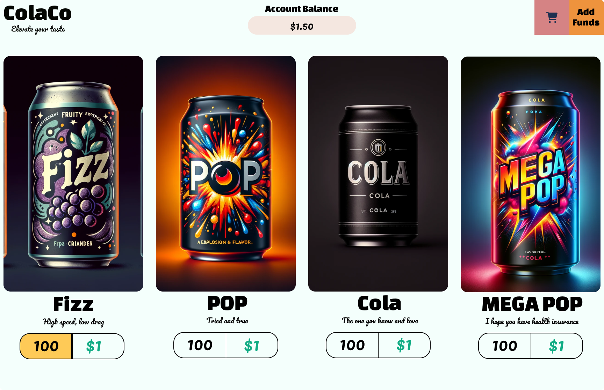

# Frontend Architecture
The frontend of the application began with a design in Figma. Backend design docs are common, but frontend designs in larger orgs are sometimes not alays a consideration. I like to operate from a design first perspective, so I created a design in Figma to help me visualize the application, and I believe this greatly aided my development velocity.

Since the front-end was not a significant focus of this project, I'll be light on details. The front end is a react single-page application using a home-rolled component library for grid layouts that I wrote. It features a couple of key functions that can be utilized by the user, which I explain below.

Here's my version of the front-end in case you don't feel like running it. I like to think I matched the design pretty closely but, given more time I'd have tried to be more exact.

## Overview of Features

### Account Creation and Management
Accounts are automatically created via a post request to the backend server on page load. This creates an admin `uuid` which gives access to the backend. To simulate a non-admin user, update the database to set the `is_admin` field to `false` for your uuid. The user id is cached to the cookies, so that way the state persists on refresh. You can delete the cookie to get a new account (but it's a bit buggy so, buyer beware). If you get a white screen, check the console or just refresh. Sometimes the updates loop a bit hard since I didn't have time to thoroughly add safeguards.

Accounts feature their own balances and can be updated by simply clicking the add funds button. Here you can submit a non-negative amount of money and have the balance updated. No reloads should be required. The system uses `react-query` to invalidate the queries when mutation operations occur.

### Buying Soda
The sodas may be purchased by clicking the quantity in the visualization (shaded in yellow above). Once you click a soda, its number will not be updated, but you will see it in your cart. You can click the cart in the top right to get an idea of what you're buying, and what the total is. When you're ready to buy it, you can click the checkout button to get your receipt. If you buy too much, the API will return an error. Promotional prices are automatically reflected in the cart and on the webpage as the system was designed to treat the pricing api as the sole source of truth, so it provides the most accurate version of the information.

## Running the Front End
I chose to use bun.js to run the front end. If you haven't used it, get hip, it's legitimately incredible. To run the UI, simply run `bun run dev` in the `colaco-ui` folder. This will start the app on `http://localhost:5173/` and you can navigate to it in your browser. The backend must be running for the front end to work. Please see the backend doc for more information on that.